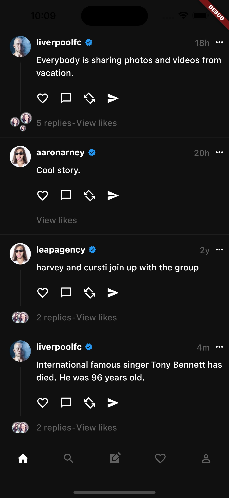
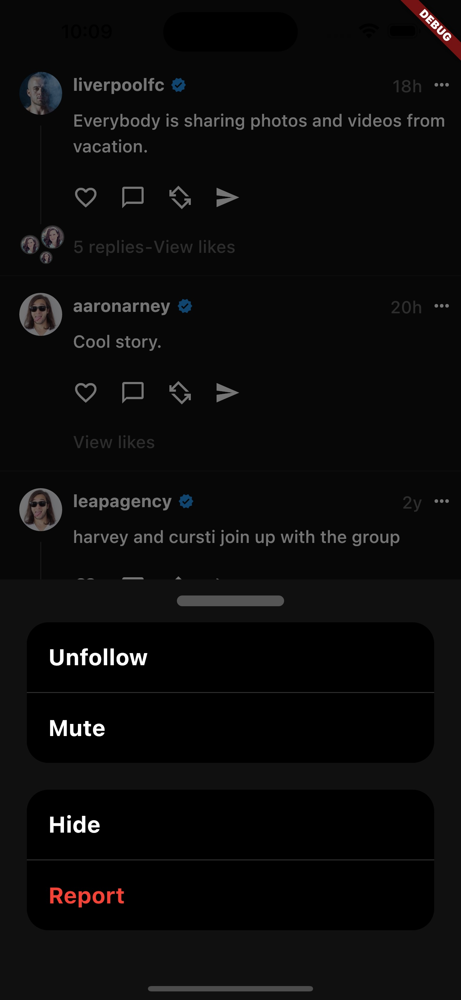

# Threads UI

This is a wholly incomplete UI for the Threads app. I wanted to rebuild parts of the UI simply for fun
and didn't really think too much about architecture. There are no state management providers or
anything of that nature.

At the moment there are only two "complete" screens, the main home page and the search page.

